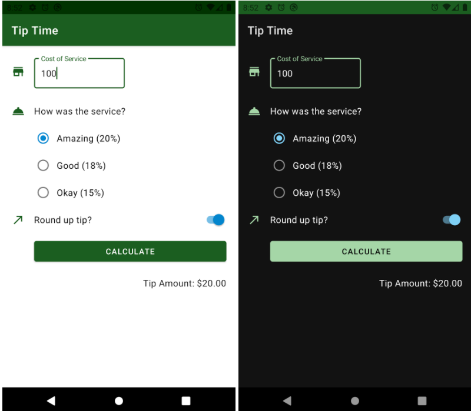

# Tip-calculator-app 
### Description
Tip Calculator app made using kotlin. 
-The Tip Calculator app contains various UI elements for calculating a tip, teaching about app structure, user input, and view binding. 

### Tools and Languages Used:

 

## Getting Started
---------------
1. Learn to kode using kotlin 
2. Install Android Studio, if you don't already have it. 
3. Download the code from the given github repository. 
4. Import the code into Android Studio. 
5. Build and run the sample.  The app looks like the following in light and dark mode respectively. 

### Developed by:
<a href="https://github.com/sambit221">Sambit Kumar Tripathy</a>
